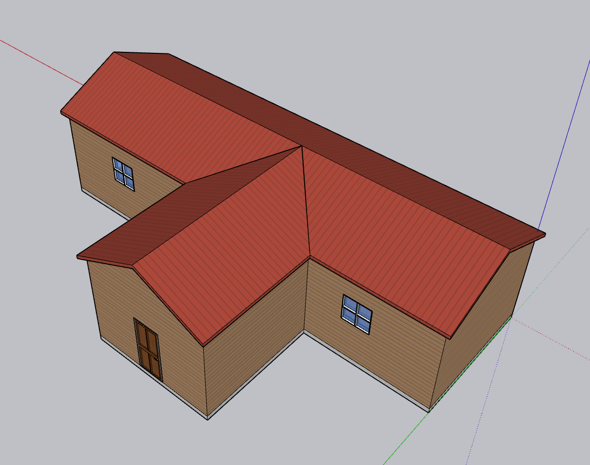
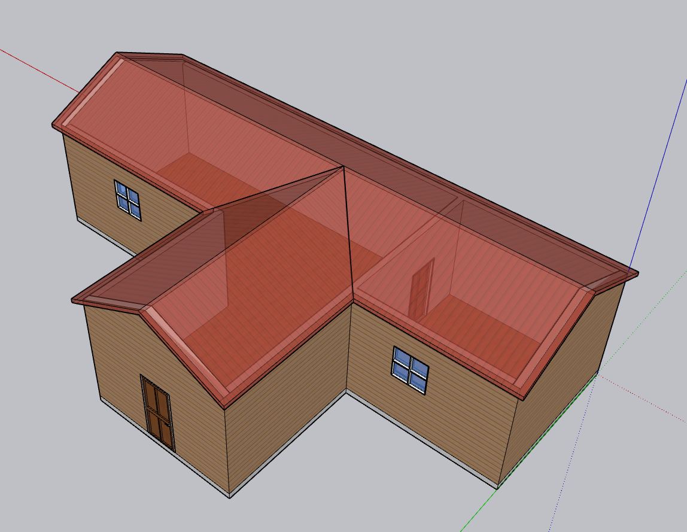

# Indiv_Xray
Sketchup addon for creating "Xray" copies of individual groups/components.

<b>NOTE: Can now be found in the SketchUp Extension Warehouse.</b>

# Installation
Install either:
 - Via the SketchUp Extension Warehouse.
 - Via the add-on manager using the .rbz file which can be downloaded from the releases menu within this repository.

# Instructions
1. Select objects that are to be "Xray'd"
2. Run the addon by either: 
</t>-Selecting: Extensions>Indiv_Xray. 
</t>-Selecting the "Indiv_Xray" toolbar icon.
3. This creates semi-transparent objects in the exact locations of the existing objects. All "Xray" objects are placed in a layer titled "Individual_Xray".
  
# Notes:
- <b>Does not work on individual surfaces unless they are turned into groups beforehand.</b> 
This is due to the way that sketchup handles ungrouped surfaces, if a surface is created in the same position as another, there is still only one selectable surface.
- <b>This extension will create it's own icon.</b>
- <b>This extension works by creating copies of materials and is also capable of handling materials with textures (even sketchup's included materials!!!).</b>

# Possible future features
- Support for surfaces (see above).

# Disclamer
<b> Use at your own risk. With that being said, I have tested it a bit and it seems to work fine. Also, everything *should* be fully reversible with undo.</b>
